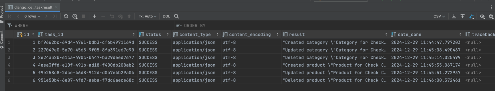

# Django HWs

## Оглавление
1. [Django ORM](#1-django-orm)
2. [Формы в Django](#2-формы-в-django)
3. [CBV и тестирование](#3-class-based-views-и-тестирование)
4. [Задачи с Celery и Redis](#4-задачи-с-celery-и-redis)

## #1. Django ORM
#### Цель:
Закрепить навыки создания проекта и приложения в Django, работы с моделями через ORM, а также настройки админки для удобной работы с данными.

#### Результат:
Рабочий проект Django с подключённой базой данных, продвинутой настройкой админки, кастомными командами и генерацией данных через фабрики.

Описание задачи

1. Создать Django проект и приложение:

    * Настроить новый проект Django.
    * Добавить приложение (например, store).

2. Создать модели:

    * Модель Product с полями: name, description, price, created_at.
    * Модель Category с полями: name, description.
    * Связать Product с Category через ForeignKey.

3. Выполнить миграции:
   
    * Создать и применить миграции.

4. Работа с ORM:

    * Создать записи для моделей, используя кастомную команду.

#### Реализация:
1. В основных настройках `config/settings.py` в переменную INSTALLED_APPS прокинут путь до созданного проекта `store_app.apps.StoreAppConfig`
2. Созданы модели:
   * Category
   * Product
   * Настроена связь one-to-many между таблицами Product-Category
3. Созданы и применены миграции
4. С помощью встроенной консоли и встроенных команд добавлены записи в обе таблицы

#### Используемые команды:

Команды Django

* `django-admin startproject config .` - инициализация django проекта
* `python3 manage.py startapp store_app` - создание приложения внутри django проекта
* `python3 manage.py runserver` - запуск приложения
* `python3 manage.py makemigrations` - создание миграции
* `python3 manage.py migrate` - применение миграции

Команды интерактивной консоли Django

* `python3 manage.py shell` - перейти в интерактивную консоль django
* `exit()` - выйти из интерактивной консоли django
   
* `category = Category.objects.create(name='with_tea', description='Description for with_tea category')` - добавление категории
* `product = Product.objects.create(name='Black Tea', description='The Best Indian Black Tea', price=120, category=category)` - добавление продукта
* `products = Product.objects.all()` - получить список всех продуктов
* `categories = Category.objects.all()` - получить список всех категорий
* `product.category` - получить категорию продукта
* `category.products.all()` - получить список продуктов катерии

## #2. Формы в Django
#### Цель:
Закрепить навыки работы с HTML-шаблонами, передачи данных из контроллеров в шаблоны и реализации форм для пользовательского ввода.

#### Результат:
Динамическое веб-приложение для интернет-магазина с отображением данных через шаблоны и возможностью добавления и редактирования товаров через формы.

Описание задачи

1. Создать шаблоны:

    * Настроить базовый шаблон с использованием block и extends.
    * Создать страницу списка товаров (Product), где отображаются название, описание и цена.
    * Настроить страницу деталей товара с выводом всех данных

2. Создать формы:

    * Настроить форму для добавления нового товара.
    * Настроить форму для редактирования товара.

3. Связь с шаблонами:
   
    * Настроить отображение ошибок валидации в шаблонах.
    * Реализовать обработку пользовательского ввода через контроллеры.

4. Настроить админку:

    * Добавить кастомизацию: list_display, list_filter, search_fields.
    * Создать кастомные действия через @admin.action. Например, поменять цену или опубликовать товар.

#### Реализация:
1. В модуле admin.py созданы модели CategoriesAdmin и ProductsAdmin для админ панели. Для моделей настроена кастомизация
2. Для всех роутов добавлены html-шаблоны (`store_app/templates/store_app`), основанные на базовом шаблоне (`store_app/templates/store_app/base.html`)
3. Для создания категорий и продуктов созданы и подключены формы
4. Реализована кастомная команда для генерации тестовых данных. Выполнить ее можно со помощью команды `python manage.py generate_test_data`, после чего будут сгенерированы 5 категорий и 25 продуктов со случайной категорией из списка созданных

## #3. Class-Based Views и тестирование
#### Цель:
Закрепить навыки работы с CBV (Class-Based Views) и написания автотестов с использованием Pytest.

#### Результат:
Приложение интернет-магазина с функциональностью CRUD через CBV и тестами для ключевых функций.

Описание/Пошаговая инструкция выполнения домашнего задания

1. Реализовать CBV:

    * Использовать ListView для отображения списка товаров.
    * Настроить DetailView для отображения деталей товара.
    * Реализовать CreateView и UpdateView для добавления и редактирования товаров.
    * Добавить DeleteView для удаления товара.

2. Написать тесты для приложения:

    * Тесты для моделей: проверить операции создания, чтения, обновления и удаления записей.

#### Реализация:
1. Реализована модель CBV
2. Написаны автотесты на основные операции приложения

## #4. Задачи с Celery и Redis
#### Цель:
Освоить использование Celery для выполнения фоновых задач и настройку Redis как брокера задач.

#### Результат:
Приложение интернет-магазина с фоновыми задачами (например, отправка уведомлений при добавлении новых товаров.)

Описание задачи

1. Настроить Celery и Redis:

    * Установить Celery и Redis.
    * Подключить Redis как брокер задач для Celery.

2. Реализовать фоновую задачу:

    * Создать задачу для логирования информации о добавлении нового товара.
    * Задача должна выводить сообщение на консоль (например, название нового товара).

3. Протестировать Celery:
   
    * Убедиться, что задачи корректно ставятся в очередь и выполняются.

#### Реализация:
1. Настройка Celery и Redis
   * Установлены Celery и Redis
   * В модуле `config/celery.py` создано приложение Celery
   * В модуле настроек проекта (`config/settings.py`) добавлено приложение django_celery_results в переменной INSTALLED_APPS, а также указаны настройки для CELERY (CELERY_BROKER_URL, CELERY_RESULT_BACKEND и др.)
   * Применены миграции для успешного создания таблиц Celery

2. Реализованы две фоновые задачи (для категории и продукта)
   * В модуле `store_app/tasks.py` реализованы две задачи. Одна задача на изменения категорий, вторая задача на изменения продуктов

3. Проверка Celery. Произведено тестирование каждого вида сообщений:
   * для создания категории
   * для изменения категории
   * для удаления категории
   * для создания продукта
   * для изменения продукта
   * для удаления продукта

Данные о задачах пишутся в таблицу **django_celery_results_taskresult**

<strong>Команды для работы с Celery</strong>

* `brew install redis` - установить redis на MacOS, используя brew
* `brew services start redis` - запустить redis
* `redis-cli ping` - проверить работоспособность redis (ответ должен быть PONG)
* `celery -A config  worker --loglevel=info` - запустить worker

